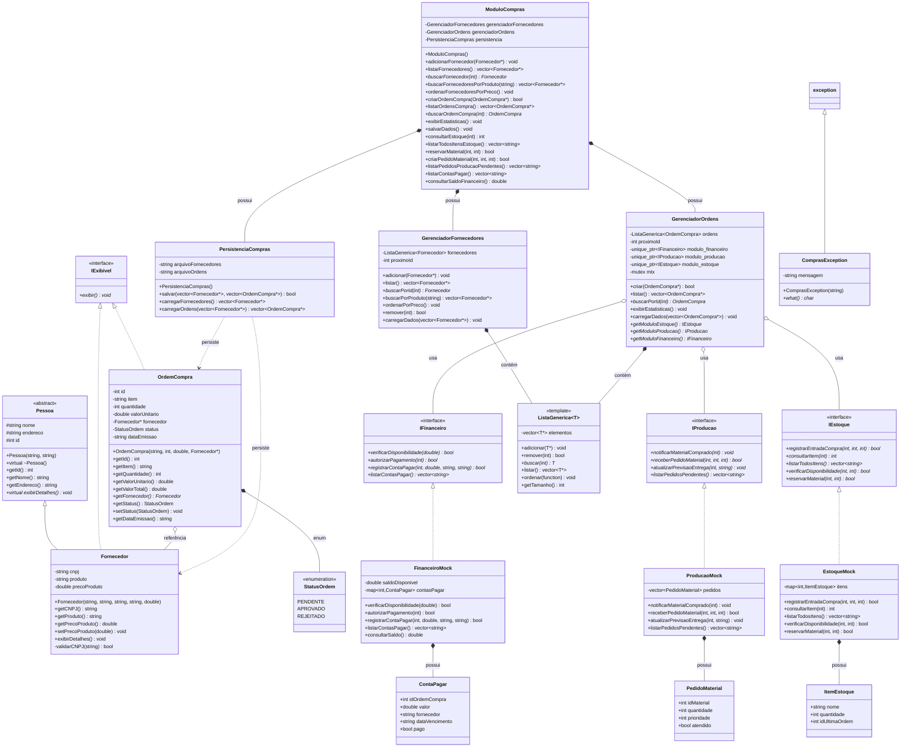

# Diagrama de Classes - Sistema ERP - Módulo de Compras

## Visão Geral da Arquitetura

Este documento apresenta o diagrama de classes completo do Sistema de Gerenciamento de Compras, desenvolvido em C++ com Programação Orientada a Objetos.

---

## Diagrama de Classes (Formato Mermaid)



---

## Diagrama de Classes (Formato Texto ASCII)

```
┌─────────────────────────────────────────────────────────────────────────────┐
│                        SISTEMA ERP - MÓDULO DE COMPRAS                      │
│                            DIAGRAMA DE CLASSES                               │
└─────────────────────────────────────────────────────────────────────────────┘

                                CAMADA DE APRESENTAÇÃO
┌─────────────────────────────────────────────────────────────────────────────┐
│                                                                               │
│                              ┌──────────────┐                                │
│                              │   main.cpp   │                                │
│                              │              │                                │
│                              │ + main()     │                                │
│                              │ + menu()     │                                │
│                              └──────┬───────┘                                │
│                                     │                                        │
└─────────────────────────────────────┼────────────────────────────────────────┘
                                      │ usa
                                      ▼
┌─────────────────────────────────────────────────────────────────────────────┐
│                         CAMADA DE LÓGICA DE NEGÓCIO                          │
│                                                                               │
│  ┌──────────────────────────────────────────────────────────────────┐       │
│  │                     ModuloCompras (Facade)                       │       │
│  │──────────────────────────────────────────────────────────────────│       │
│  │ - gerenciadorFornecedores: GerenciadorFornecedores              │       │
│  │ - gerenciadorOrdens: GerenciadorOrdens                          │       │
│  │ - persistencia: PersistenciaCompras                             │       │
│  │──────────────────────────────────────────────────────────────────│       │
│  │ + adicionarFornecedor()                                          │       │
│  │ + criarOrdemCompra()                                             │       │
│  │ + consultarEstoque()                                             │       │
│  │ + criarPedidoMaterial()                                          │       │
│  │ + listarContasPagar()                                            │       │
│  │ + salvarDados()                                                  │       │
│  └──────────────┬────────────────────┬──────────────────────────────┘       │
│                 │                    │                                       │
│                 │ possui             │ possui                                │
│                 ▼                    ▼                                       │
│  ┌──────────────────────────┐   ┌───────────────────────────┐              │
│  │ GerenciadorFornecedores  │   │   GerenciadorOrdens       │              │
│  │──────────────────────────│   │───────────────────────────│              │
│  │ - fornecedores           │   │ - ordens                  │              │
│  │ - proximoId              │   │ - proximoId               │              │
│  │──────────────────────────│   │ - modulo_financeiro       │              │
│  │ + adicionar()            │   │ - modulo_producao         │              │
│  │ + listar()               │   │ - modulo_estoque          │              │
│  │ + buscarPorId()          │   │ - mtx: mutex              │              │
│  │ + buscarPorProduto()     │   │───────────────────────────│              │
│  │ + ordenarPorPreco()      │   │ + criar()                 │              │
│  │ + remover()              │   │ + listar()                │              │
│  └──────────┬───────────────┘   │ + buscarPorId()           │              │
│             │ usa                │ + exibirEstatisticas()    │              │
│             │                    └─────┬──────┬──────┬───────┘              │
│             │                          │      │      │                      │
│             │                     usa  │      │      │ usa                  │
│             ▼                          ▼      ▼      ▼                      │
│  ┌──────────────────────┐   ┌─────────────────────────────────────┐        │
│  │  ListaGenerica<T>    │   │     INTERFACES DE INTEGRAÇÃO        │        │
│  │──────────────────────│   │─────────────────────────────────────│        │
│  │ <<template>>         │   │  <<interface>>    <<interface>>     │        │
│  │──────────────────────│   │  IEstoque         IProducao         │        │
│  │ - elementos          │   │                                     │        │
│  │──────────────────────│   │  <<interface>>                      │        │
│  │ + adicionar()        │   │  IFinanceiro                        │        │
│  │ + remover()          │   └─────┬──────────┬──────────┬─────────┘        │
│  │ + buscar()           │         │          │          │                  │
│  │ + listar()           │         │ impl     │ impl     │ impl             │
│  │ + ordenar()          │         ▼          ▼          ▼                  │
│  └──────────────────────┘   ┌─────────────────────────────────────┐        │
│                              │  EstoqueMock  ProducaoMock          │        │
│                              │                                     │        │
│                              │  FinanceiroMock                     │        │
│                              └─────────────────────────────────────┘        │
└─────────────────────────────────────────────────────────────────────────────┘

┌─────────────────────────────────────────────────────────────────────────────┐
│                          CAMADA DE DOMÍNIO                                   │
│                                                                               │
│                        ┌──────────────────┐                                  │
│                        │  <<abstract>>    │                                  │
│                        │     Pessoa       │                                  │
│                        │──────────────────│                                  │
│                        │ # nome: string   │                                  │
│                        │ # endereco       │                                  │
│                        │ # id: int        │                                  │
│                        │──────────────────│                                  │
│                        │ + getNome()      │                                  │
│                        │ + getEndereco()  │                                  │
│                        │ + exibirDetalhes()* │                               │
│                        └────────┬─────────┘                                  │
│                                 │                                            │
│                                 │ herança                                    │
│                                 ▼                                            │
│  ┌────────────────────────────────────────────────┐                         │
│  │              Fornecedor                        │                         │
│  │────────────────────────────────────────────────│                         │
│  │ - cnpj: string                                 │                         │
│  │ - produto: string                              │◄────────┐               │
│  │ - precoProduto: double                         │         │               │
│  │────────────────────────────────────────────────│         │               │
│  │ + getCNPJ()                                    │         │ referência    │
│  │ + getProduto()                                 │         │               │
│  │ + getPrecoProduto()                            │         │               │
│  │ + setPrecoProduto()                            │         │               │
│  │ + exibirDetalhes()                             │         │               │
│  │ - validarCNPJ()                                │         │               │
│  └────────────────────────────────────────────────┘         │               │
│                                                              │               │
│  ┌─────────────────────────────────────────────────────────┐│               │
│  │              OrdemCompra                                 ││               │
│  │──────────────────────────────────────────────────────────││               │
│  │ - id: int                                                ││               │
│  │ - item: string                                           ││               │
│  │ - quantidade: int                                        ││               │
│  │ - valorUnitario: double                                  ││               │
│  │ - fornecedor: Fornecedor*                                │├───────────────┘
│  │ - status: StatusOrdem                                    ││
│  │ - dataEmissao: string                                    ││
│  │──────────────────────────────────────────────────────────││
│  │ + getId()                                                ││
│  │ + getItem()                                              ││
│  │ + getQuantidade()                                        ││
│  │ + getValorTotal()                                        ││
│  │ + getFornecedor()                                        ││
│  │ + getStatus()                                            ││
│  │ + setStatus()                                            ││
│  └──────────────────────────────────────────────────────────┘│
│                                                               │
│           ┌──────────────────────┐                            │
│           │  <<enumeration>>     │                            │
│           │   StatusOrdem        │                            │
│           │──────────────────────│                            │
│           │ PENDENTE             │                            │
│           │ APROVADO             │                            │
│           │ REJEITADO            │                            │
│           └──────────────────────┘                            │
└─────────────────────────────────────────────────────────────────────────────┘

┌─────────────────────────────────────────────────────────────────────────────┐
│                           CAMADA DE DADOS                                    │
│                                                                               │
│  ┌──────────────────────────────────────────────────────────────┐           │
│  │              PersistenciaCompras                             │           │
│  │──────────────────────────────────────────────────────────────│           │
│  │ - arquivoFornecedores: string                                │           │
│  │ - arquivoOrdens: string                                      │           │
│  │──────────────────────────────────────────────────────────────│           │
│  │ + salvar()                                                   │           │
│  │ + carregarFornecedores()                                     │           │
│  │ + carregarOrdens()                                           │           │
│  └──────────────────────────────────────────────────────────────┘           │
│                                                                               │
└─────────────────────────────────────────────────────────────────────────────┘

┌─────────────────────────────────────────────────────────────────────────────┐
│                      TRATAMENTO DE EXCEÇÕES                                  │
│                                                                               │
│  ┌──────────────────────────────────────────────────────────────┐           │
│  │              ComprasException                                │           │
│  │──────────────────────────────────────────────────────────────│           │
│  │ - mensagem: string                                           │           │
│  │──────────────────────────────────────────────────────────────│           │
│  │ + what()                                                     │           │
│  └──────────────────────────────────────────────────────────────┘           │
│                      │                                                       │
│                      │ herda de                                              │
│                      ▼                                                       │
│              std::exception                                                  │
└─────────────────────────────────────────────────────────────────────────────┘
```

---

## Descrição Detalhada dos Relacionamentos

### 1. Herança
- **Pessoa → Fornecedor**: Fornecedor herda atributos e métodos de Pessoa
- **exception → ComprasException**: Exceção customizada para o domínio

### 2. Implementação de Interfaces
- **IEstoque ← EstoqueMock**: Implementação simulada do módulo de estoque
- **IProducao ← ProducaoMock**: Implementação simulada do módulo de produção
- **IFinanceiro ← FinanceiroMock**: Implementação simulada do módulo financeiro
- **IExibivel ← Fornecedor, OrdemCompra**: Interface para exibição de dados

### 3. Composição (tem-um, parte-todo)
- **ModuloCompras ◆ GerenciadorFornecedores**: ModuloCompras contém e gerencia
- **ModuloCompras ◆ GerenciadorOrdens**: ModuloCompras contém e gerencia
- **ModuloCompras ◆ PersistenciaCompras**: ModuloCompras contém e gerencia
- **GerenciadorFornecedores ◆ ListaGenerica<Fornecedor>**: Contém lista de fornecedores
- **GerenciadorOrdens ◆ ListaGenerica<OrdemCompra>**: Contém lista de ordens
- **EstoqueMock ◆ ItemEstoque**: Mock contém itens de estoque
- **ProducaoMock ◆ PedidoMaterial**: Mock contém pedidos de material
- **FinanceiroMock ◆ ContaPagar**: Mock contém contas a pagar

### 4. Agregação (tem-um, compartilhado)
- **OrdemCompra ◇ Fornecedor**: Ordem referencia fornecedor (não possui)
- **GerenciadorOrdens ◇ IEstoque**: Usa interface de estoque
- **GerenciadorOrdens ◇ IProducao**: Usa interface de produção
- **GerenciadorOrdens ◇ IFinanceiro**: Usa interface financeiro

### 5. Dependência (usa)
- **PersistenciaCompras ⋯> Fornecedor**: Persiste dados de fornecedores
- **PersistenciaCompras ⋯> OrdemCompra**: Persiste dados de ordens
- **main.cpp ⋯> ModuloCompras**: Interface usa facade

---

## Padrões de Projeto Aplicados

### 1. Facade Pattern
**Classe**: `ModuloCompras`
- Simplifica o acesso aos subsistemas complexos
- Fornece interface unificada para GerenciadorFornecedores, GerenciadorOrdens e PersistenciaCompras

### 2. Mock Object Pattern
**Classes**: `EstoqueMock`, `ProducaoMock`, `FinanceiroMock`
- Simula comportamento de módulos externos
- Permite testes sem dependências reais

### 3. Template Method Pattern
**Classe**: `ListaGenerica<T>`
- Estrutura genérica reutilizável
- Funciona com qualquer tipo de objeto

### 4. Dependency Injection
**Classe**: `GerenciadorOrdens`
- Recebe interfaces (IEstoque, IProducao, IFinanceiro)
- Baixo acoplamento com implementações concretas

---

## Conceitos de POO Demonstrados

### Encapsulamento
- Atributos privados em todas as classes
- Acesso controlado via getters/setters
- Validações nos métodos públicos

### Herança
- Pessoa → Fornecedor (especialização)
- Reutilização de código da classe base
- Método virtual puro exibirDetalhes()

### Polimorfismo
- Interfaces com métodos virtuais puros
- Implementações específicas em cada mock
- Template genérico ListaGenerica<T>

### Abstração
- Classe abstrata Pessoa
- Interfaces IEstoque, IProducao, IFinanceiro
- Ocultação de detalhes de implementação

---

## Estatísticas do Sistema

- **Total de Classes**: 15 classes
- **Interfaces**: 4 interfaces
- **Classes Abstratas**: 1 (Pessoa)
- **Templates**: 1 (ListaGenerica)
- **Enumerações**: 1 (StatusOrdem)
- **Classes Mock**: 3 (simulação de módulos)
- **Estruturas de Dados**: 3 (ItemEstoque, PedidoMaterial, ContaPagar)

---

## Camadas da Arquitetura

### Camada 1: Apresentação
- `main.cpp` - Interface com usuário

### Camada 2: Lógica de Negócio
- `ModuloCompras` (Facade)
- `GerenciadorFornecedores`
- `GerenciadorOrdens`
- Interfaces de integração

### Camada 3: Domínio
- `Pessoa` (abstrata)
- `Fornecedor`
- `OrdemCompra`
- `StatusOrdem`

### Camada 4: Dados
- `PersistenciaCompras`
- Arquivos: fornecedores.txt, ordens.txt

### Camada 5: Infraestrutura
- `ListaGenerica<T>`
- `ComprasException`
- Classes Mock

---

**Nota**: Este diagrama pode ser visualizado usando ferramentas que suportam Mermaid, como:
- GitHub (renderização automática)
- VS Code com extensão Mermaid Preview
- Mermaid Live Editor (https://mermaid.live)
- Ferramentas de documentação (Docusaurus, MkDocs)
